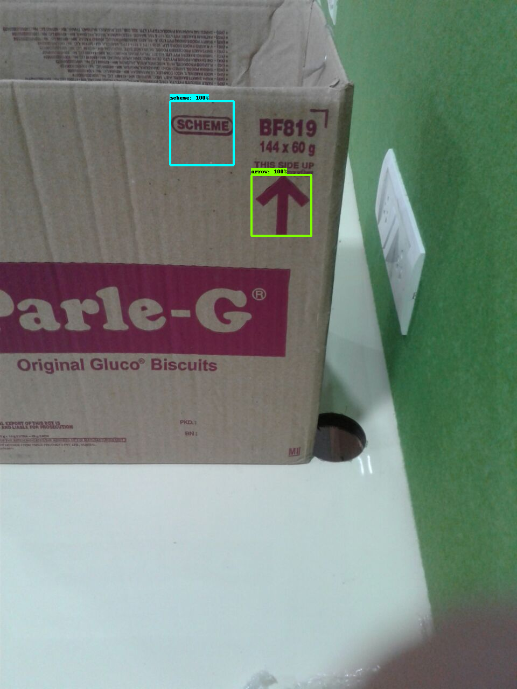

# Parleg Boxes Code Detection

This is a script to detect the code of a box in a Parleg box on conveyor belt. As the boxes are of diffrent sizes and shapes we use tensorflow object detection API to detect the code of the box. After that easyocr is used to detect the text in the box.


Improved version of the code with detection and recognition of the code of the box is at [Parleg-Beta](https://github.com/gamingflexer/parleg-beta)
Do check Out!!

# Installation

Use a virtual enviorment and Follow the instructions to install tensorflow object detection API. 

- https://www.youtube.com/watch?v=dZh_ps8gKgs

`cd production`

Install requirements by using this command

`pip install -r requirements.txt`

# Usage

### Flask

Starts a server at `http://127.0.0.1:5000/video_feed` with the video stream and it prints the ocr outputs in the terminal.

```
python app.py
```

### Single Video

``` 
cd production
python test.py "path of the video"
```

## Detection Sample



## OCR Sample

The video output is also saved in the ocr.txt file which looks like this

```
Next Box Coming
'BOX 1'--> 8C681['8C681'] - frame210.jpg
Next Box Coming

Next Box Coming
'BOX 2'--> BF821['BF821'] - frame510.jpg
'BOX 3'--> BF824['BF824'] - frame540.jpg
Next Box Coming
```

## Project Structure

